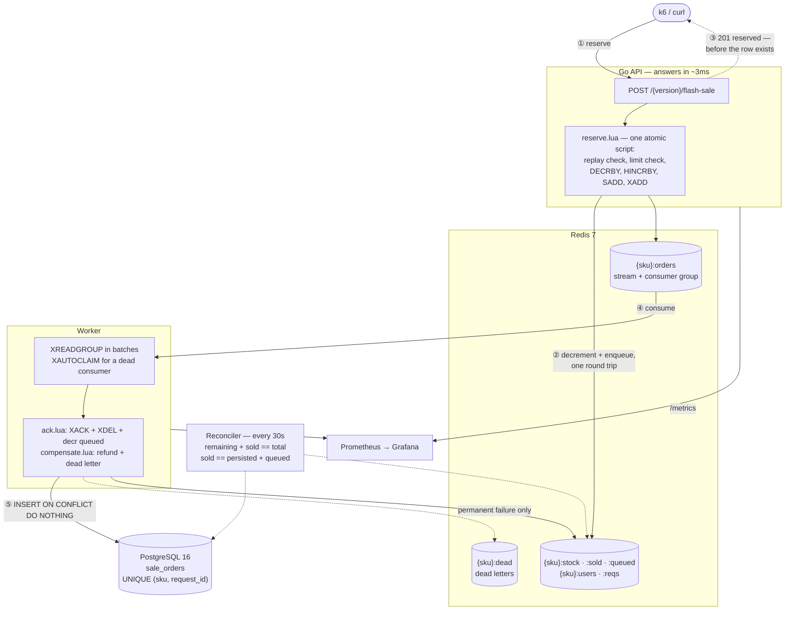

# flash-sale

A limited-stock flash sale service in Go that will not oversell, built three times
over so the cost of each design is measurable rather than asserted.

The same correctness suite runs against all three implementations. They differ
only in where atomicity comes from:

| | `v1` postgres-update | `v2` redis-lua | `v3` redis-stream |
|---|---|---|---|
| Atomicity from | a row lock in a transaction | a Lua script in Redis | the same script, plus a stream |
| Order row written | synchronously, in the transaction | never | asynchronously, by a worker |
| **Sustainable throughput** | **700 req/s** | **12,000 req/s** | **10,000 req/s** |
| p99 at that rate | 4.3 ms | 32 ms | 42 ms |
| Peak achieved | 769 req/s | 14,269 req/s | 11,275 req/s |
| p99 when overloaded | 3,344 ms | 380 ms | 622 ms |
| Oversold units | 0 | 0 | 0 |

v2 sustains **17× v1's throughput**. v3 gives back a sixth of that for a durable
order row and still sustains 14× v1.

Note the row that is *not* flattering to v2: at its own sustainable rate v2's p99
is 32 ms against v1's 4.3 ms. **v1 is not slow — it is narrow.** Below 700 req/s
it answers in 1.4 ms median and there is nothing wrong with it. Past that, the row
lock stops absorbing concurrency and p99 goes to three full seconds; v2 under the
same treatment degrades to 380 ms. The difference is not speed, it is the load at
which each design stops working.

Measured on one machine with the load generator sharing it, so the ratios are
worth more than the absolute numbers. Method and full results: §6 and
[`docs/benchmarks.md`](docs/benchmarks.md).

---

## 1. What it does

`POST /flash-sale` takes one unit of a SKU off the shelf for one user, exactly
once, under concurrency, and answers in single-digit milliseconds. Overselling is
the failure this project exists to prevent: two buyers must never both win the
last unit, and a buyer who retries must not get two.

```bash
curl -XPOST localhost:8080/v3/flash-sale \
  -H 'Content-Type: application/json' \
  -H 'X-User-Id: alice' -H 'X-Request-Id: req-1' \
  -d '{"sku":"switch-2","qty":1}'
# {"status":"reserved","backend":"redis-stream","sku":"switch-2",
#  "request_id":"req-1","remaining":99}
```

Replay `req-1` and the answer is `duplicate` with the same remaining count. Ask
for a second unit as `alice` and it is `user_limit`. When the shelf is empty it is
`sold_out`, with HTTP 409 — a business answer, not an error.

## 2. Architecture



The split is the whole design: **decrementing stock is fast and must be
immediate; creating the order is slow and can wait.** The buyer gets a receipt
that says they won. The row appears milliseconds later.

v1 collapses this into one synchronous transaction. v2 drops the order row
entirely. v3 is the one you would ship.

## 3. Quick start

Needs Docker and `make`. Nothing else.

```bash
make up          # api, worker, postgres, redis, prometheus, grafana
curl localhost:8080/healthz
curl localhost:8080/backends
```

| | |
|---|---|
| API | http://localhost:8080 |
| Grafana | http://localhost:3000 — opens on the dashboard, no login |
| Prometheus | http://localhost:9090 |

```bash
make test        # correctness suite, all three backends
make bench-v2    # 50 VUs for 30s
make ramp        # steps the arrival rate up to find the knee
make spike       # 500/s, then 15,000/s instantly, then 500/s
make soak        # 30 minutes below the knee
make fault-test  # kills the worker and every DB connection mid-load
```

`make test` needs Postgres and Redis reachable. It **skips rather than fails**
when they are not, so check that it is not lying to you:

```bash
go test ./... -v | grep -c SKIP   # must print 0
```

## 4. Design decisions and trade-offs

### Why a Lua script instead of a database lock

v1 is not a strawman. It is the textbook version, and `CHECK (stock >= 0)` means
Postgres itself would refuse to oversell even with broken application logic. What
it cannot escape is the shape of the problem: **every buyer of one SKU contends on
one row.**

```sql
UPDATE products
   SET stock = stock - $2
 WHERE sku = $1 AND stock >= $2
RETURNING stock, per_user_limit
```

That row lock is held until commit, so the product row serialises the entire sale
and throughput becomes a function of transaction latency. Below ~700 req/s that
does not hurt: the lock is free when a request arrives and the median response is
1.4 ms. Past it the queue forms, and at 50 concurrent buyers the median request
spends over 100 ms waiting for a lock rather than doing work.

v2 does not optimise the lock, it removes it. Redis runs a Lua script to
completion single-threaded, so the script *is* the unit of atomicity — replay
check, per-user limit, decrement, and bookkeeping all commit together with no
network round trip held open in the middle. p99 is essentially one RTT.

The honest version of the comparison: v1 is deliberately written as six round
trips (BEGIN, replay check, UPDATE, limit check, INSERT, COMMIT) with the lock
held across the last three. Folding it into a single statement or a stored
function would shorten the hold and narrow the gap. It would still serialise on
the row. That variant is not measured here.

### Why Redis Streams instead of Kafka

The queue needs consumer groups, acknowledgement, a pending list, and redelivery
of whatever a dead consumer was holding. Streams have all four. Kafka would add
a broker, a coordinator, and a second operational story to a service whose only
other dependency is already Redis — for capabilities this workload does not use.
The cost is that durability is now Redis's durability, which §7 is honest about.

The decisive detail is that `XADD` happens **inside `reserve.lua`**. Stock is
decremented and the order is enqueued in the same script, so there is no window
where a unit is sold but no order exists. Any design that decrements and then
publishes has that window, and no amount of retry logic closes it.

### Why the API answers before the row exists

Because the buyer's question is "did I get one?", and Redis already knows. Making
them wait for a Postgres insert would put the slowest component on the critical
path of the fastest decision. The receipt is authoritative: the unit is already
theirs in the only place that counts stock.

The price is that `sale_orders` trails reality by however far the worker is
behind — visible as `flash_sale_stream_pending` on the dashboard. A ramp to
1.6M reservations left a 719,175-order backlog that drained in 53 s, so the
writer sustains roughly 13,500 inserts/s. Every reservation landed.

### What happens when things break

| Failure | Consequence |
|---|---|
| Worker dies | Nothing is lost. Entries stay in the pending list; `XAUTOCLAIM` hands them to another consumer after `STREAM_CLAIM_IDLE`. Verified by `make fault-test`. |
| Postgres unreachable | Backlog grows, reservations keep succeeding. Connection errors are retried **forever** — they are transient by nature, and giving a unit back because the database blinked would be the real bug. |
| Permanent write error | Retried `STREAM_MAX_DELIVERIES` times, then `compensate.lua` refunds the unit and moves the order to `{sku}:dead`. Permanent means a Postgres error of class 22 (invalid data) or 23 (integrity violation), or a message the consumer cannot parse. Everything else is transient by default — the safe direction, because refunding a unit the buyer legitimately won is worse than retrying. |
| Worker persists then dies before ACK | The entry is redelivered and re-inserted. `UNIQUE (sku, request_id)` plus `ON CONFLICT DO NOTHING` makes that a no-op. |
| **Redis dies** | The sale stops, and unpersisted reservations are lost with it. This is the real limit of the design — see §7. |

### Why a reconciler, given all of the above

Because every mechanism above is a claim, and claims about distributed state need
an auditor that does not share their assumptions. Every 30 s it checks two
equations per SKU:

```
remaining + sold == total          # Redis internally consistent
sold == persisted + queued         # Redis and Postgres agree
```

The first is exact — its counters come from one `MULTI`. The second cannot be,
because the worker commits to Postgres *before* it acknowledges in Redis, so a
check landing in that window sees a legitimate disagreement. A mismatch is
therefore only counted after it survives two consecutive rounds, and the
reconciler reads Redis on both sides of the Postgres query so that a Redis that
moved underneath the comparison is reported as `busy` rather than as a mismatch.

## 5. How correctness is verified

**The acceptance test is arithmetic, not sampling.** Stock 100, 1,000 goroutines
racing, and the assertion is that exactly 100 won — not approximately 100.

```
TestReserveConcurrent        stock 100, 1000 buyers → reserved == 100 exactly,
                             sold_out == 900, no other outcome, and afterwards
                             remaining == 0, units_sold == 100, distinct
                             buyers == 100, reservations == 100
TestReserveIdempotent        the same request_id twice → one unit
TestReserveConcurrentReplay  200 goroutines, one request_id → one unit
TestReservePerUserLimit      one user, many attempts → PER_USER_LIMIT units
TestReserveUnknownSKU        no silent creation
```

Every assertion is on a final count, never on a sample or a tolerance.

Those five run against **all three backends** from one table-driven suite, which
is why v1 cannot be deleted: it is the correctness control, not just the slow
number. Six more cover the v3 worker — persistence, crash recovery, permanent vs
transient failure, compensation idempotency, and the reconciler catching a row
deleted behind its back.

25 tests and subtests, no skips, 1.9 s.

**Fault injection** goes further than unit tests can. `make fault-test` runs a
load test and, while it is in flight, kills the worker for 5 s and then
terminates every Postgres connection:

```
ok   backlog drained
ok   remaining + sold == total (2,000,000)
ok   persisted == sold (523,504)
ok   queued == 0
ok   order rows == request_ids (no loss, no duplicate)
dead letters: 0
```

Three runs, all green, exit 0. Zero compensations is the expected result rather
than a lucky one: both injected failures are transient, and the consumer retries
those forever. The compensation path is proven by the unit test that forces a
permanent error.

**Not covered:** `go test -race` does not build on the development machine (no
gcc). The concurrency assertions are on final counts rather than on the race
detector, so they hold regardless, but CI should run `-race`.

## 6. Load testing

Four profiles, all driving the identical request from `k6/lib/sale.js`:

| | what it answers |
|---|---|
| `flash-sale.js` | throughput at fixed concurrency — the baseline table |
| `ramp.js` | where is the knee? |
| `spike.js` | what does an instant surge cost, and does it recover? |
| `soak.js` | does anything drift over 30 minutes? |

Method: stock is seeded to millions so the SKU never runs dry, because a sold-out
request takes a shorter code path and would flatter whichever backend rejects
faster. Every `X-User-Id` and `X-Request-Id` is unique, so neither the per-user
limit nor the idempotency check can short-circuit the write path. **Every request
measured is a successful write.**

The ramp and spike use **arrival rate, not VUs**. A constant-VU test cannot
overload a service: slower responses simply mean fewer requests. Open-model load
keeps arriving whether or not the last one came back, which is what a sale
opening actually does.

### The knee

v1 first, because it is the surprising one. `make ramp VERSION=v1` with 100/s
steps:

| arrival | achieved | p50 | p99 |
|---|---|---|---|
| 100/s | 100/s | 1.71 ms | 4.44 ms |
| 400/s | 400/s | 1.44 ms | 3.24 ms |
| 700/s | 700/s | 1.39 ms | **4.26 ms** |
| 800/s | **769/s** | 358 ms | 944 ms |
| 900/s | 749/s | 1,955 ms | 3,015 ms |
| 1,000/s | 661/s | 2,782 ms | 3,344 ms |

Seven steps of *nothing happening* — p99 actually falls as the pool warms — and
then a wall. One step past the limit the median response is 358 ms; two steps past
it, two seconds. The row lock either absorbs the concurrency or it does not, and
there is almost no middle.

Then v2 and v3, `make ramp`, ten 20-second steps of 2,000/s:

| arrival | v2 achieved | v2 p99 | v3 achieved | v3 p99 |
|---|---|---|---|---|
| 2,000/s | 2,000/s | 2.02 ms | 2,000/s | 2.10 ms |
| 4,000/s | 3,991/s | 5.95 ms | 3,995/s | 7.29 ms |
| 6,000/s | 5,976/s | 8.91 ms | 5,971/s | 13.44 ms |
| 8,000/s | 7,954/s | 14.31 ms | 7,925/s | 21.81 ms |
| 10,000/s | 9,839/s | 25.25 ms | 9,720/s | 42.03 ms |
| 12,000/s | 11,694/s | 32.24 ms | **11,275/s** | 70.89 ms |
| 14,000/s | 13,295/s | 51.76 ms | 10,399/s | 377 ms |
| 16,000/s | **14,269/s** | 99.67 ms | 9,496/s | 532 ms |
| 18,000/s | 13,740/s | 198 ms | 9,068/s | 558 ms |
| 20,000/s | 12,498/s | 380 ms | 10,502/s | 622 ms |

Both versions show **congestion collapse**, not a plateau: past the peak,
offering more load gets you *less* throughput and much worse latency. v2 peaks at
14,269/s and is down to 12,498/s when offered 20,000/s. That is the number worth
knowing about a system, and a fixed-VU benchmark cannot show it.

Sustainable rate — where achieved still tracks arrival within 3% and p99 stays
double-digit — is about **12,000/s for v2 and 10,000/s for v3**.

Caveat: at 18,000/s and above, k6 hit its own VU ceiling, so the *arrival* column
is nominal there. The *achieved* column is real, and achieved throughput falling
while VUs climb is the service saturating, not the generator.

### The spike

`make spike`, 500/s for 20 s, then an instant step to 15,000/s for 30 s, then
500/s again. No warm-up, no gradual scaling of anything:

| | v2 p99 | v3 p99 |
|---|---|---|
| calm (500/s) | 1.54 ms | 1.70 ms |
| spike (15,000/s) | 63.34 ms | 480 ms |
| recover (500/s) | **1.53 ms** | 9.46 ms |
| achieved during spike | 14,311/s | 11,201/s |
| failed requests | 0 | 0 |

v2 returns to its calm p99 exactly. v3 recovers to 9.46 ms rather than 1.70 ms
because the worker is still draining the spike's backlog while the recovery phase
runs — the reservation path has recovered, the write path has not yet caught up.
Neither version dropped or errored a single request at 30× its calm rate.

### The soak

`make soak`, v3 at 8,000/s — below the knee, where the question is not "how fast"
but "does anything rot". 10 minutes, of which 9 are at a flat 7,989 req/s and
4,308,338 requests. Comparing the first 90 seconds of steady state against the
last:

| | first | last | drift |
|---|---|---|---|
| p50 | 0.37 ms | 0.37 ms | −0.01 ms |
| p95 | 1.70 ms | 1.50 ms | −0.20 ms |
| p99 | 4.33 ms | 3.49 ms | **−0.84 ms** |
| Write backlog | 36 orders | 39 orders | +3 |
| API RSS | 101.4 MiB | 104.8 MiB | +3.4 MiB |
| Worker RSS | 22.9 MiB | 23.0 MiB | +0.1 MiB |
| Errors | 0 | 0 | — |

Nothing drifts. p99 ends *lower* than it starts, which is what a warmed
connection pool and a loaded script cache look like. The backlog oscillates
between 25 and 77 orders and never trends — the writer stays ahead of a 7,989/s
producer all the way through, having 4.3M orders to insert.

Final books, after the last batch drained:

```
total 30,000,000   remaining 25,123,676   sold 4,876,324
persisted 4,876,324   rows 4,876,324   duplicate request_ids 0
queued 0   stream 0   dead 0   compensations 0   reconcile mismatches 0
```

**One thing the soak did surface**, and it is a false alarm worth writing down:
API goroutines step from 171 to 491 two minutes in and stay there. That is k6's
arrival-rate executor allocating VUs to hold the rate, one server goroutine per
connection — it returns to 10 the moment load stops, and the spike test's peak of
6,781 goroutines also collapsed to 10. A real leak does not come back down.

This run is **10 minutes, not 30**. The profile's default was shortened to 10
because a default nobody runs is worth nothing; `make soak DURATION=30m` is
still there and the longer run has not been recorded here.

### Baselines

Fixed concurrency, 50 VUs, 30 s, three alternating runs per version:

| | v1 | v2 | v3 |
|---|---|---|---|
| Throughput | 434–491 req/s | 13,309–15,554 req/s | 10,972–11,308 req/s |
| p99 | 273–303 ms | 7.6–8.6 ms | 9.2–9.6 ms |

These are the numbers the project was originally built around, and the ramp shows
why they should not be the headline: **50 VUs puts every version past its own
knee.** At 3 ms latency, 50 concurrent VUs offer ~16,000 req/s, which is past
v2's peak; for v1 they offer 20× what the row lock can absorb. Both versions were
being measured in their collapse region, which is why the v2 spread is wide
(13.3k–15.6k across runs) and why v1's p99 reads 290 ms instead of the 4.3 ms it
delivers at a rate it can actually serve.

**That also means the 34.9× v2-over-v1 ratio from the fixed-concurrency runs
overstates the gap.** Compared at each version's sustainable rate the ratio is
17×, not 35×. The larger number is not wrong — it is a real measurement of what
happens at 50 concurrent buyers — but it credits v2 for v1 collapsing rather than
for v2 scaling, and 17× is the number this README leads with.

## 7. Known limitations

Listed because a reviewer will find them anyway, and finding them listed is
different from finding them hidden.

**Redis is a single point of failure, and the unpersisted window is real.** A
reservation is durable in Redis and only eventually in Postgres. If Redis dies
with a backlog, those reservations are gone and the buyers hold receipts for
orders that will never exist. AOF with `appendfsync everysec` narrows the window;
it does not close it. Closing it properly means a durable log in front of the
decrement, which costs the latency this design exists to avoid. **This is the
trade-off, not an oversight** — but a real sale would need a Redis replica and a
documented recovery procedure, and this project has neither.

**One Redis, one SKU, one CPU.** A single SKU's keys share a hash slot by design,
so one hot SKU is served by one Redis core and the ceiling in §6 is that core's
ceiling. Many SKUs scale out across a cluster; one viral SKU does not.

**The load generator shares the machine with the system under test.** Absolute
numbers are depressed by an unknown amount, and above ~14,000/s k6 competes with
the API for CPU. Ratios between versions are trustworthy; the ceiling is a floor.

**Reseeding a live SKU can lose the in-flight batch.** `SeedStock` deletes the
stream, but a worker already holding a batch may insert it afterwards, against
stock that has been reset. Seed idle SKUs only.

**v2 and v3 must not share a SKU name.** They use the same Redis keys, so a name
used by both mixes two sales.

**Observability gaps.** `deadLetter()` is not counted. Both reconciler equations
increment one counter with no `equation` label, so an alert cannot say which one
broke. The per-SKU stock gauges come from the API, not the worker, deliberately —
`fault-test` kills the worker, and the backlog explodes at exactly that moment.
The per-SKU panels colour by series name using Grafana's palette, which is not
colour-blind-safe; every other series on the dashboard uses a palette that is.

**A metrics scrape writes to Redis.** `RegisteredSKUs` prunes dead entries with
`SREM` as it reads. Idempotent, but a scrape is not read-only.

**No alertmanager.** Five rules in `prometheus/alerts.yml` evaluate and can be
seen firing at `:9090/alerts`; nothing routes them anywhere.

**Deliberately out of scope:** authentication (`X-User-Id` is the identity), a
frontend, payments, an admin UI, Kubernetes.

## 8. Layout

```
cmd/api          three backends mounted under /v1 /v2 /v3, all serving at once
cmd/worker       consumer, reconciler, metrics listener
internal/flashsale
  flashsale.go   Status / Request / Result / the Reserver interface
  postgres.go    v1: conditional UPDATE in a transaction
  redis.go       v2: EVALSHA
  stream.go      v3: StreamReserver, SeedStock, DropSKU
  reserve.lua    the atomic script; XADDs when given 6 keys
  consumer.go    XREADGROUP batches, XAUTOCLAIM, compensation
  ack.lua        batched XACK + XDEL + decrement queued
  compensate.lua refund + dead letter, XACK as the ownership check
  reconcile.go   both equations, plus StockLevels for the gauges
internal/httpapi instrument wrapper times every reservation
internal/metrics the only package that imports Prometheus
k6/lib/sale.js   the workload every profile shares
k6/{ramp,spike,soak}.js
prometheus/      scrape config + five alert rules
grafana/         provisioned datasource and dashboard
docs/            benchmarks and a line-by-line walkthrough
```

Three backends, one `Reserver` interface, so the tests and handlers are written
once and run against everything.
